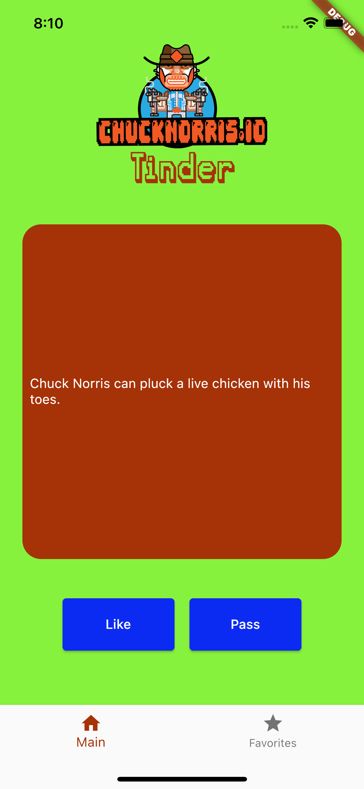
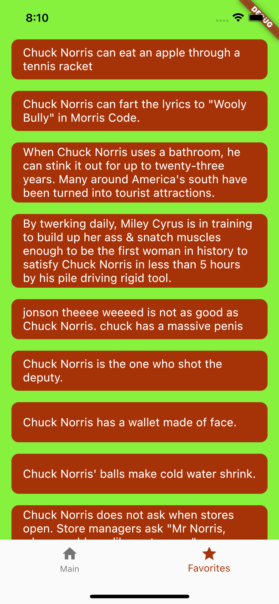

# Chuck Norris Tinder Application

## Requests
 I am using http to recieve jokes from API and json_serializable to get value of joke
 ```
 Future<String> getNewJoke() async {
  var response =
      await http.get(Uri.parse('https://api.chucknorris.io/jokes/random'));
  return jsonDecode(response.body)['value'];
}
 ```

 ## Widgets

The list of using widgets:
- MaterialApp
- Scaffold
- SafeArea
- Column, Row
- Padding
- Container

I used StatelessWidget to create the basic screen content like header and image. To add elements that can change their state during the work of application I used StatefulWidget (joke card).

## Linter
I used flutter_lint and option+shift+f command

## Code formater: Passed

## Screenshot of the app

[APK](app-release.apk)



